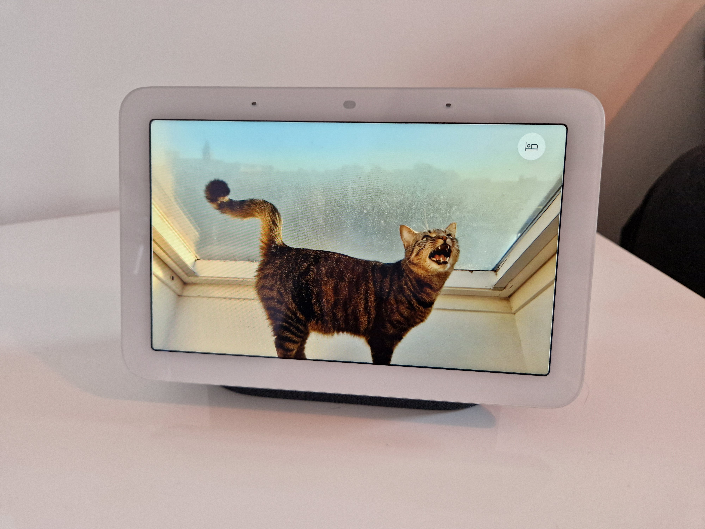
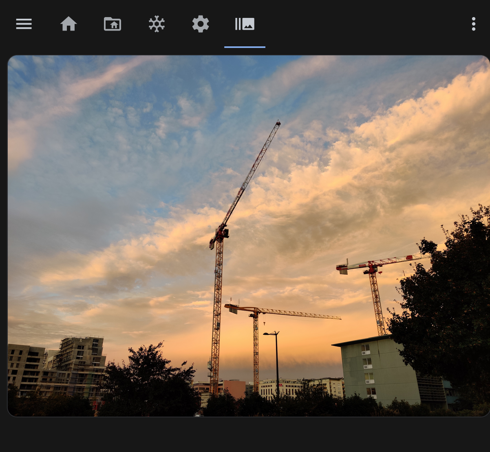
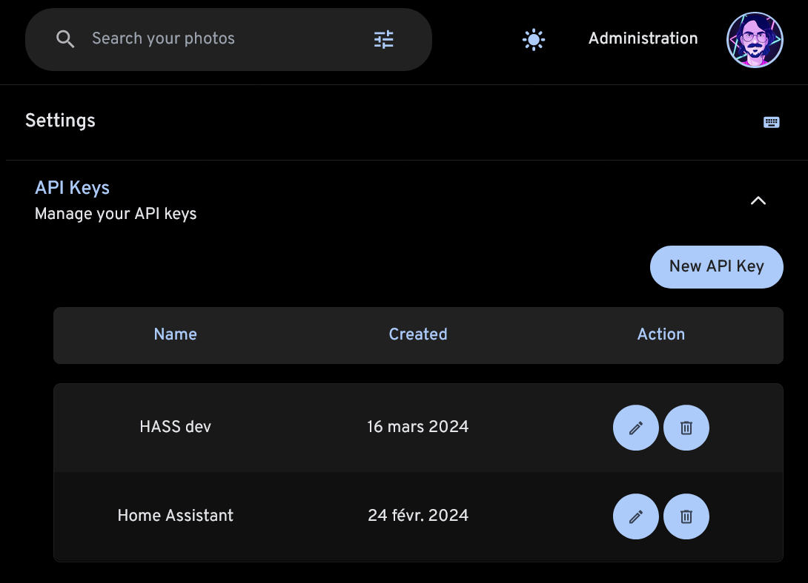
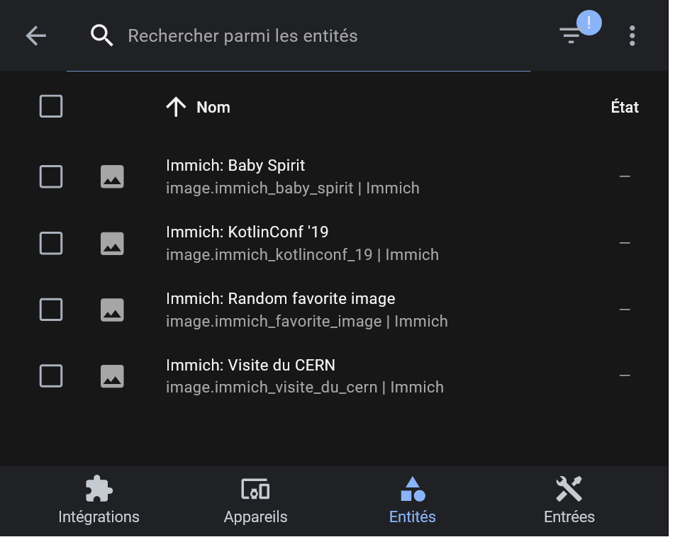

# Immich × Home Assistant  

This custom integration for Home Assistant allows you to display random pictures from your Immich instance right inside your dashboards.

### What is Immich?

Immich is a "high performance self-hosted photo and video backup solution".  
[Find more on their website](https://immich.app).

### What is Home Assistant?

Home Assistant provides "open source home automation that puts local control and privacy first".  
[Find more on their website](https://www.home-assistant.io).

## Installation

Install this component _via_ [HACS](https://hacs.xyz).

[](https://my.home-assistant.io/redirect/hacs_repository/?repository=immich-home-assistant&category=Integration&owner=outadoc)

Restart Home Assistant once the integration has been installed.

## What can I do with this project?

As a suggestion, you could use this integration to create a picture frame. You can create a "pane" dashboard, and display your picture entity inside of it:

```yaml
type: panel
title: Photo frame
path: photo-frame
icon: mdi:image-frame
subview: true
cards:
  - type: picture-entity
    entity: image.immich_favorite_image
    show_state: false
    show_name: false
    aspect_ratio: "16:9"
    fit_mode: contain
```

You can then use this dashboard on a dedicated device in kiosk mode.

You could even display in onto a Nest Hub device with the [Home Assistant Cast](https://www.home-assistant.io/integrations/cast/#home-assistant-cast) feature − you can finally say goodbye to Google Photos! 🎉

```yaml
- service: cast.show_lovelace_view
  data:
    entity_id: media_player.<your-chromecast-device>
    dashboard_path: lovelace
    view_path: photo-frame
```



## How does it work?

The integration can provide multiple `image` entities, which each correspond to an album. Each entity will switch to a new random image every 5 minutes.

These entities can be displayed using standard lovelace cards − for example, the `picture`, or `picture-entity` cards.



## Configuration

You can set up the Immich integration right from the web UI.

[](https://my.home-assistant.io/redirect/config_flow_start/?domain=immich)

You will need to enter your instance's URL and an API key. You can generate it from your Account Settings, on your Immich instance.



### Exposing other albums

By default, only the "Favorites" album is exposed as an entity.

You can expose more albums on the integration's options page.

> [!WARNING]  
> Exposing many albums might consume a lot of resources on your Home Assistant machine, and will also increase the number of calls to your Immich instance.


